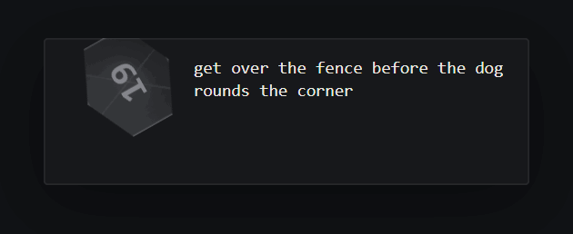
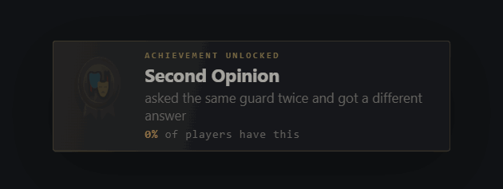
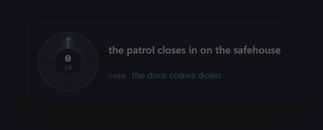
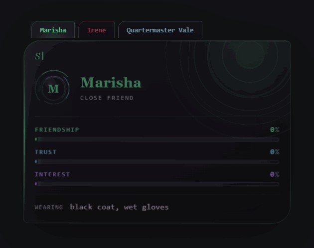
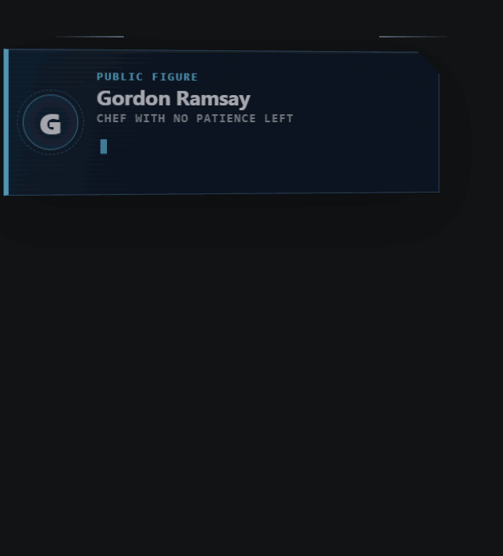

# vladislav

Tiny visual trackers and one-shot widgets for SillyTavern.

The model writes a short marker. A display-only regex turns it into a styled,
animated widget, while a separate cleaner removes old markers from the model's
context.


## Download

| Language | Stable bundle | Includes |
|---|---|---|
| English | [Download `vladislav-en.zip`](https://github.com/tankisthuieglot-hue/vladislav/releases/latest/download/vladislav-en.zip) | RPG HUD, Dice, Achievement, Clock, Relationship, Critics, Encounter Dossier, shared service regexes |
| Russian | [Download `vladislav-ru.zip`](https://github.com/tankisthuieglot-hue/vladislav/releases/latest/download/vladislav-ru.zip) | RPG HUD, Dice, Achievement, Clock, Relationship, Critics, Encounter Dossier, shared service regexes |

Install **one** language bundle, not both. The selected language controls the
fixed interface labels; values generated by the model still follow the language
of your roleplay.

JavaScript interactions require
[SillyTavern-JS-support](https://github.com/MiNtorikaSoul/SillyTavern-JS-support).

Stable releases contain only reviewed widgets. Other folders in `src/` and
`dist/` are experiments and may change before they enter a release.

## Stable widgets

### RPG HUD

Tracks the player character's visible condition, clothing, inventory, and up to
five setting-appropriate gauges. It does not invent mana, corruption, emotions,
or other mechanics that do not belong in the current roleplay.

The inventory folds away, critical situations distort the panel, and temporary
effects such as concussion or poisoning obscure the readings until tapped.


Folder: [`dist/hud/`](dist/hud/)

### Dice

Shows a one-time d20 check: the attempted action, rolled result, target number,
outcome, and any immediate cost. The die tumbles in place after a streamed
message finishes and can be clicked to replay the animation without changing
the model-provided result.

The English showcase runs through every outcome from a critical success to a
fumble:



Folder: [`dist/dice/`](dist/dice/)

### Achievement

Awards a completely serious system achievement for something stupid,
memorable, or needlessly destructive. The model supplies a deadpan title,
what earned it, rarity, and one of ten safe icon variants.

The medal drops into place, catches a highlight, and counts up the colored
rarity percentage. The English showcase contains all ten icons and all four
rarity color bands:



Folder: [`dist/ach/`](dist/ach/)

### Clock

Tracks a danger that advances across multiple scenes: an approaching patrol,
a spreading rumour, an expiring deadline, or anything else with four, six, or
eight steps before a concrete consequence.

Filled sectors lock into the dial one by one while a scanner hand sweeps to the
current boundary. The English showcase includes every legal state from `0/4`
through `8/8`:



Folder: [`dist/clock/`](dist/clock/)

### Relationship

Shows how named NPCs currently relate to the player without assigning emotions,
clothing, or decisions to the player. Each NPC gets three relationship signals,
a status, visible clothing, and a short narrator comment. If nobody relevant is
present, the model emits no widget.

Several NPC markers in one message merge into a tabbed character deck. The
strongest signal colors the name, border, aura, and orbiting identity seal.
Love adds a heartbeat, while fear fractures and shakes the card instead of
reusing the same effect in another color:



Folder: [`dist/rel/`](dist/rel/)

### Unsolicited Critics

Rarely interrupts the end of a scene after the player does something especially
bold, questionable, clever, or catastrophic. Two or three random recognizable
public figures, anime characters, or historical figures independently score
the action and leave a short comment.

They are not a jury: there is no average, consensus, winner, or shared verdict.
Public figures arrive as broadcast cards, anime characters cut into the chat
like cel panels, and historical figures land as engraved metal plaques. Scores
count up independently, comments type in, and clicking the widget replays the
interruption:



Folder: [`dist/critic/`](dist/critic/)

### Encounter Dossier

Appears when a meaningful new person or creature enters the scene, when a
boss-level threat becomes clear, or when a hidden identity is finally revealed.
Every marker is a complete event, so the dossier never relies on an older
marker that may already have been cleaned from context.

The closed tracker is a worn physical folio with stitching, brass corners, a
name bookmark, and a working clasp. Opening it turns the leather cover in 3D
and fans out three separate sheets. Threat, faction, gear, ability, weakness,
and appearance are not repeated rows: they become a wax seal, stamped
affiliation, pinned equipment tag, pulsing rune card, unfoldable note, and
handwritten margin observations. Unknown boss intelligence stays blurred and
cycles through symbols instead of being invented:


Folder: [`dist/encounter/`](dist/encounter/)

## Install in five minutes

1. Install
   [SillyTavern-JS-support](https://github.com/MiNtorikaSoul/SillyTavern-JS-support).
2. Download and extract the bundle for your language.
3. Import every JSON file from `service/` into
   **Extensions → Regex → Import**, in filename order.
4. Open a widget folder. Copy all of `1-prompt.txt` into a new enabled
   **System** prompt in your preset.
5. Import `2-regex.json` and `3-cleaner.json` into
   **Extensions → Regex → Import**.

Keep each widget's renderer above `99-fallback` in the Regex list. A folder
always contains exactly the same three user-facing files:

```text
hud/
├── 1-prompt.txt      copy into the preset as a System prompt
├── 2-regex.json      import into Regex
└── 3-cleaner.json    import into Regex
```

See [INSTALL.md](INSTALL.md) for the complete walkthrough and troubleshooting.

## Why it is lightweight

This is everything the model has to produce for a full RPG HUD:

```text
[[VLD_HUD|N=Vlad Kostsov|A=32|H=178 cm|B1=Health|V1=6|B2=Stamina|V2=3|C=wet parka|I=knife, flask|S=bruised knuckles]]
```

| Layer | How it works | Added message tokens |
|---|---|---:|
| Marker | A compact line generated by the model | Small |
| Widget | Display-only regex injects HTML, CSS, and JavaScript | 0 |
| Cleanup | Prompt-only regex removes markers older than three messages | 0 |

The rendered HTML is never sent back to the model. Recent raw markers remain
briefly available for continuity, then disappear from the outgoing context.

## Built for imperfect model output

Field order does not matter. Optional fields may be missing. Unknown fields are
ignored. Numeric and enum values are constrained before they can reach HTML
attributes. Broken or unclosed markers are hidden rather than dumped into chat.

The test suite runs malformed markers through the actual built regexes in both
languages:

```bash
npm install
npm run all
```

## Development

Sources live in `src/`; generated SillyTavern files live in `dist/`.

```bash
npm run check
npm run build
npm run preview
```

Create fresh screenshots:

```bash
node tools/shot.mjs
```

Record a tracker animation:

```bash
node tools/record.mjs en dice
node tools/record.mjs en hud
node tools/record.mjs en clock
node tools/record.mjs en rel
node tools/record.mjs en critic
node tools/record.mjs en encounter
```

The authoring format and validator rules are documented in
[docs/AUTHORING.md](docs/AUTHORING.md).

## License

[MIT](LICENSE)

## SillyTavern community

Looking for presets, setup help, experiments, or simply other SillyTavern users
to talk to? Join the Discord:

### [Join the Discord server](https://discord.gg/h5uUf7VZvx)
