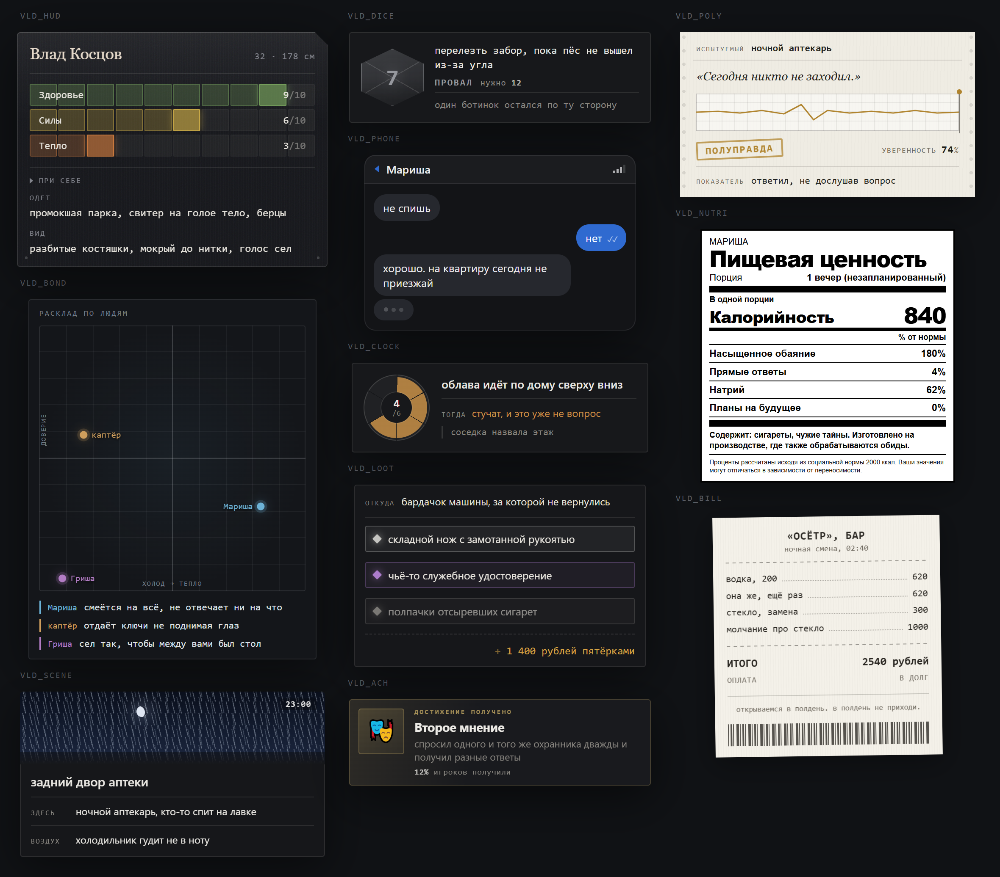
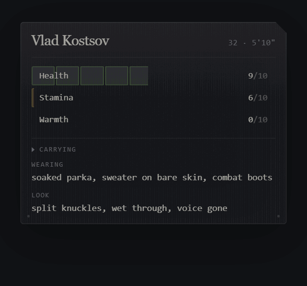
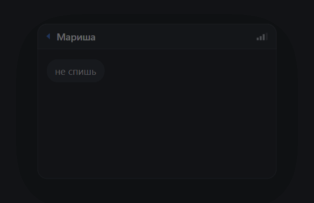
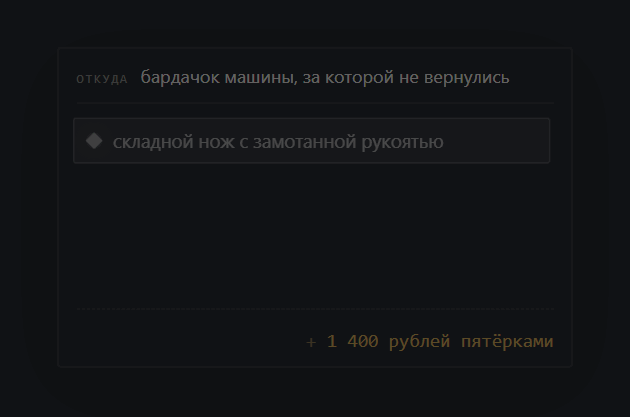
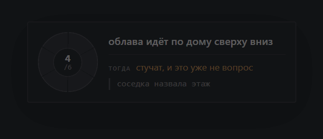

# vladislav

Визуальные трекеры для SillyTavern. Модель пишет одну короткую строку —
читатель видит виджет.



```
[[VLD_HUD|N=Влад Косцов|A=32|H=178 см|B1=Здоровье|V1=6|B2=Силы|V2=3|C=промокшая парка|I=нож, фляга|S=разбитые костяшки]]
```

Вот это — всё, что уходит в модель и возвращается от неё. Разметка, стили и
анимация подставляются регексом **только при отображении**, поэтому виджет не
стоит ни одного токена.

## Одиннадцать трекеров

Каждый занят своим делом и выглядит по-своему. Ставить можно любой, они друг о
друге не знают.

| | Что показывает | Чем отличается |
|---|---|---|
| 🎚️ **HUD** | состояние персонажа | до пяти шкал, набор приносит сеттинг; пока герой оглушён, показания расплываются и их надо нажать |
| 🎯 **BOND** | отношение людей к герою | не шкала, а точка на плоскости: тепло и доверие ходят врозь |
| 🌅 **SCENE** | где мы и который час | час нарисован цветом неба, погода — отдельным слоем поверх |
| 🎲 **DICE** | бросок на проверку | единственный виджет-мгновение: d20, порог, цена |
| 📱 **PHONE** | переписка | пузыри, галочки, «печатает» |
| 🕛 **CLOCK** | угроза через несколько сцен | сегментный циферблат; замкнулся — красный |
| 💰 **LOOT** | добыча | цвет как разряд, а не как уровень; легендарному разрешено сиять |
| 🏆 **ACH** | достижение | абсолютно серьёзная плашка о чём-то позорном |
| 📉 **POLY** | правду ли сказал | бумажная лента самописца, единственный светлый в паке |
| 🥫 **NUTRI** | персонаж как продукт | этикетка пищевой ценности, чёрным по белому |
| 🧾 **BILL** | счёт | термочек с рваным краем и штрихкодом |

Свежие картинки каждого — `docs/media/shots/`, собираются одной командой:

```bash
node tools/shot.mjs
```

Картинка не передаёт главного — движения. Вот HUD целиком: шкалы наливаются,
инвентарь раскрывается, а после удара по голове показания расплываются, пока
не нажмёшь.



| | | |
|---|---|---|
|  |  |  |

Записать любой трекер на любом языке:

```bash
node tools/record.mjs ru clock
```

## Установка

Три файла на трекер, порядок в именах. Подробно — в [INSTALL.md](INSTALL.md).

```
dist/hud/ru/
  1-prompt.txt     → в пресет, роль System
  2-regex.json     → Extensions · Regex · Import
  3-cleaner.json   → туда же
```

Плюс один раз `dist/service/` — пять общих скриптов.

Нужно расширение
[SillyTavern-JS-support](https://github.com/MiNtorikaSoul/SillyTavern-JS-support).
Без него виджеты всё равно отрисуются и оживут: разметка, стили и анимации
работают сами. Не будет только докрутки цифр в HUD и нажатия на панель.

Языки: `en` и `ru`. Ставится одна папка. Значения внутри виджета модель пишет на
языке ролевой независимо от выбора — это указано в самом промпте.

## Почему это дёшево

| Слой | Механизм | Токены |
|---|---|---|
| Маркер | промпт-блок в пресете | 300–570 на трекер, один раз |
| Виджет | regex «только отображение» | **0** |
| Забывание | regex «только промпт», глубже 3 сообщений | **0** |

Отрисовка не трогает сохранённое сообщение — в истории остаётся сырой маркер, а
HTML в запрос не уходит вообще. Чистилка вырезает и сам маркер, когда сообщение
уходит глубже трёх: свежие три модель видит для непрерывности, дальше контекст
чистый.

Потолок промпта — 600 токенов, и это не обещание: `npm run check` не даст
собрать пак, если правила разрослись. Ставить все одиннадцать сразу
необязательно и незачем — бери то, во что играешь.

## Если модель ошиблась

Она ошибётся. Грамматика это переживает:

| Что сделала модель | Что видит читатель |
|---|---|
| переставила поля | обычный виджет |
| пропустила поля | строки исчезли, остальное цело |
| добавила своё поле | проигнорировано |
| написала текст вместо числа | шкала пустая, вёрстка цела |
| посчитала по стобалльной шкале | `87` читается как 8 из 10 |
| выдумала слово вне списка | эффекта нет, остальное на месте |
| вписала кавычку или `<script>` | остаётся текстом, разметкой не становится |
| не закрыла скобки | ничего не видно |
| опечаталась в теге | ничего не видно |

Сырой текст в чат не попадает ни в одном случае — за этим следит последний
скрипт в списке. Проверяется не на словах: набор кривых маркеров генерируется
из полей каждого трекера и прогоняется через **собранный** пак.

```bash
node tools/adversarial.mjs ru
```

Пятнадцать случаев на трекер, оба языка. Утечка — это ненулевой код возврата, а
не строчка в отчёте.

## Свой трекер

Исходники в `src/`, сборка кладёт готовое в `dist/`.

```bash
npm run check && npm run build
npm run preview
```

Как устроен трекер и что проверяет валидатор — [docs/AUTHORING.md](docs/AUTHORING.md).

## Происхождение

Подход — маркер, regex «только отображение», чистка контекста по глубине — взят
из паков SillyTavern, прежде всего MODERN by MiNtorika. Это то, как SillyTavern
работает в принципе, а не чья-то собственность.

Код здесь свой: грамматика разбора, вёрстка, стили, тексты промптов, сборка.
Ничего не скопировано дословно.

## Лицензия

MIT.
